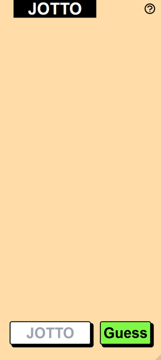
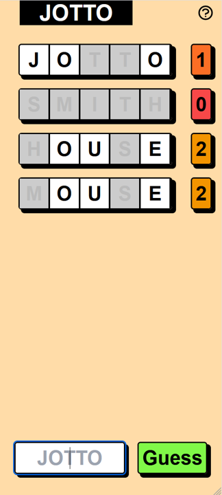
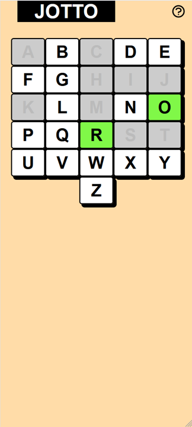

# JOTTO

### Description
&nbsp;&nbsp;&nbsp;&nbsp;&nbsp;&nbsp;A take on Wordle where the only information provided during gameplay is the total number of correct letters irregardless if the specific location was correct.

### Features
* Randomly generate 5 letter word from the backend.
* Submit guesses and see whether letters and correct or wrong.
* Select specific letters in words to state that they are eliminated.
* Select specific letters from an alphabet and they are eliminated app wide.
* Start a new game with the plus icon.
* See a list of the alphabet along with known eliminated and correct letters, through the question mark icon.

### Technologies used
* tRPC
* TypeScript
* NextJS
* Zod - Schema validation and type generation

 

## Getting Started
___
### What you will need
* A server to host the package

### Setup
1. Clone repo
2. npm install
3. Run dev server:  
`npm run dev`

### Easy Hosting
&nbsp;&nbsp;&nbsp;&nbsp;&nbsp;&nbsp;We recommend using **Vercel** to host the website.

 

## Screenshots
___

View on first visiting website

View while playing the game

View after selecting the question mark in the upper right corner

Tooltip when hovering over question mark

Tooltip when hovering over plus icon

 

### TODO
___
- [ ] Winning Screen
- [ ] Left Click (correct letter), Right Click (eliminate letter)